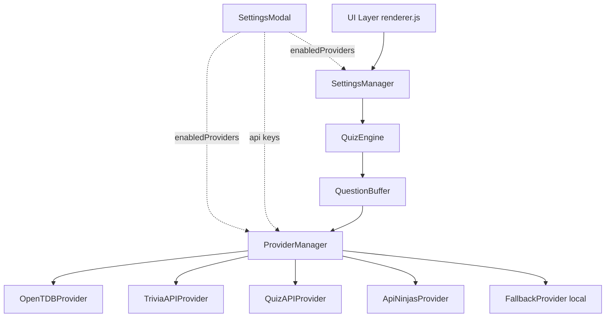

# QuizSphere Architecture

Vanilla HTML/CSS/JS infinite trivia website, fully static and deployable anywhere (e.g. GitHub Pages, Cloudflare Pages).

## System Diagram

## State Machine
`QuizEngine` operates on a simple state machine:
- `idle`: Initial state.
- `loading`: Waiting for `QuestionBuffer` to prefetch questions.
- `show_question`: Active question is displayed.
- `answered`: User has selected an answer, waiting for auto-advance.
- `error`: Failed to load questions after multiple retries.

## Data Flow
1. **Settings Update**: `SettingsManager` calls `QuizEngine.changeSettings(difficulty, provider)`.
2. **Prefetching**: `QuestionBuffer` flushes and maintains a queue of questions for the selected difficulty and provider.
3. **Provider Rotation/Selection**: `ProviderManager` rotates between APIs if "all" is selected, or uses the specific target provider. If an API fails, it falls back or skips.
4. **Game Loop**: `QuizEngine` pulls from `QuestionBuffer`. If empty, it polls. Once answered, it auto-advances.

## Component Responsibilities
- **Providers**: Fetch and normalize questions into a standard `NormalizedQuestion` shape. Handle API-specific rate limits and API keys.
- **Engine**: Manage game state, score tracking, and buffer coordination.
- **UI**: Pure DOM manipulation based on engine state. `SettingsManager` handles difficulty and provider dropdowns. `SettingsModal` handles toggling providers and managing API keys.

## Provider Quirks & Constraints
- **API Ninjas**: Free tier does not support `limit` or `difficulty` parameters. `ApiNinjasProvider` internally loops with a 300ms delay to fulfill batch requests and artificially tags responses with the requested difficulty.
- **QuizAPI (Tech)**: Requires `Authorization: Bearer <key>` header and returns questions nested inside a `data` array.
- **API Key Storage**: Keys for premium/auth-required providers are requested via `SettingsModal` and stored persistently in the browser's `localStorage`.
