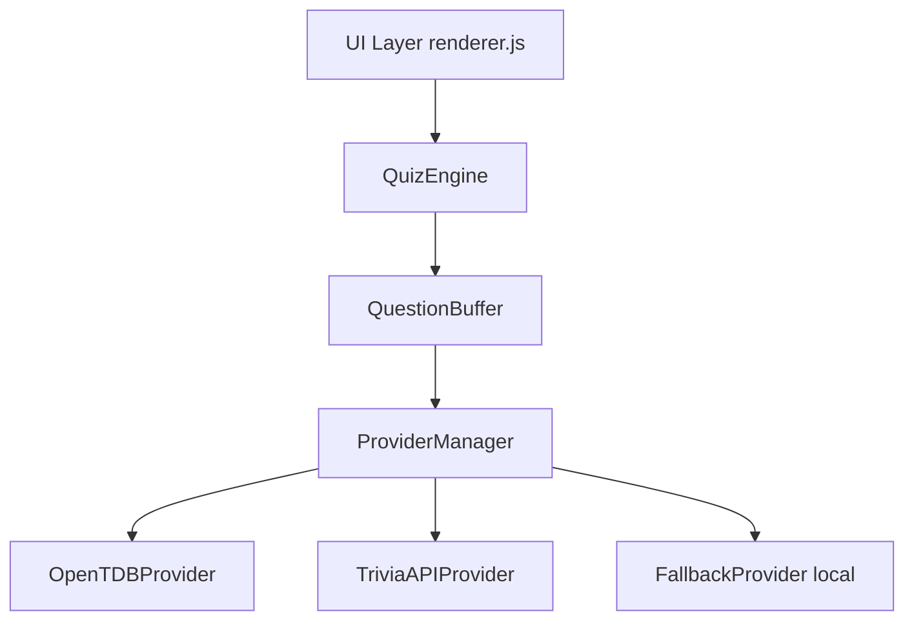

# QuizSphere Architecture

Vanilla HTML/CSS/JS infinite trivia website, fully static and deployable anywhere (e.g. GitHub Pages, Cloudflare Pages).

## System Diagram

## State Machine
`QuizEngine` operates on a simple state machine:
- `idle`: Initial state.
- `loading`: Waiting for `QuestionBuffer` to prefetch questions.
- `show_question`: Active question is displayed.
- `answered`: User has selected an answer, waiting for auto-advance.
- `error`: Failed to load questions after multiple retries.

## Data Flow
1. **Prefetching**: `QuestionBuffer` maintains a queue of questions. When the queue drops below `BUFFER_MIN_THRESHOLD`, it requests a batch from `ProviderManager`.
2. **Provider Rotation**: `ProviderManager` rotates between APIs. If an API fails or returns an empty batch, it's placed on cooldown.
3. **Fallback**: If all APIs fail, `FallbackProvider` serves local questions.
4. **Game Loop**: `QuizEngine` pulls from `QuestionBuffer`. If empty, it polls. Once answered, it auto-advances.

## Component Responsibilities
- **Providers**: Fetch and normalize questions into a standard `NormalizedQuestion` shape. Handle API-specific rate limits and timeouts.
- **Engine**: Manage game state, score tracking, and buffer coordination.
- **UI**: Pure DOM manipulation based on engine state. Manages accessibility and animations.
